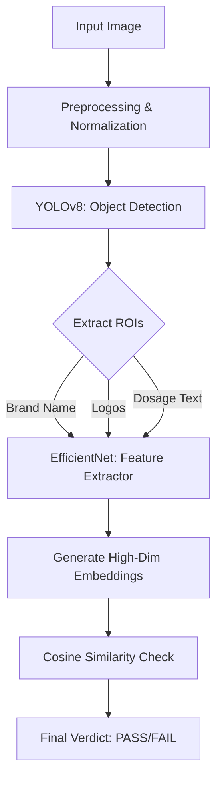

# 🛡️ TrueMed: Backend & AI Verification Engine

[](https://fastapi.tiangolo.com/) [](https://www.python.org/) [](https://www.tensorflow.org/) [](https://www.docker.com/) []()

> **A Deep Learning-powered API for detecting counterfeit pharmaceuticals through granular packaging analysis.**

## 📖 Overview

The **TrueMed Backend** serves as the intelligent core of the TrueMed ecosystem. Unlike standard barcode scanners that can be easily faked, this system employs a **Deep Metric Learning** approach. It analyzes the physical structure of medicine packaging—verifying fonts, logos, and spacing—to distinguish between authentic products and high-quality counterfeits.

Built for performance, the API handles image normalization, object detection, and feature embedding comparison in near real-time.

---

## 🧠 The AI Architecture

The system utilizes a multi-stage pipeline to break down and verify packaging:



### 1. Object Detection (Localization)

We utilize a custom-trained **YOLOv8** model to identify specific Regions of Interest (ROIs) on the packaging, ensuring we analyze the right data regardless of camera angle:

* Brand & Generic Names
* Manufacturer Logos
* Dosage Descriptors
* Barcodes/QR Codes

### 2. Deep Metric Learning (Verification)

Detected ROIs are cropped and processed by a specialized **EfficientNet** model. This extracts a numerical "fingerprint" (embedding) of the visual features.

* **The Logic:** We calculate the **Cosine Similarity** between the scan and our database of authentic references.
* **The Threshold:** If the similarity score dips below our strict confidence threshold, the specific feature is flagged as an anomaly.

---

## 🛠️ Technology Stack

| Component | Technology |
| --- | --- |
| **Framework** | FastAPI (Python 3.10) |
| **Server** | Uvicorn (ASGI) |
| **Object Detection** | Ultralytics YOLOv8 |
| **Feature Extraction** | TensorFlow / Keras (EfficientNet) |
| **Data Processing** | NumPy, OpenCV, Scikit-learn |
| **Deployment** | Docker, Hugging Face Spaces |

---

## 🚀 Key Features

* **⚡ High-Performance Inference:** Optimized TensorFlow binaries ensure rapid verification results.
* **🔍 Granular ROI Analysis:** The system doesn't just pass/fail the image; it tells you *exactly* what failed (e.g., "Logo is correct, but Dosage Font is incorrect").
* **📂 Hot-Swappable References:** New medicines can be added to the `reference_images/` directory and recognized immediately without server downtime.
* **☁️ Containerized:** Fully Dockerized for consistent deployment across any environment.

---

## 🔌 API Documentation

### 1. Verify Medicine

**Endpoint:** `POST /verify`


Analyzes an uploaded image against the specified medicine's authentic reference.

**Request:** `multipart/form-data`

* `file`: The image file (JPG/PNG)
* `medicine_name`: String (e.g., "Panadol")

**Response:**

```json
{
  "status": "success",
  "verdict": "COUNTERFEIT",
  "passed_rois": 5,
  "total_rois": 6,
  "details": [
    { 
      "roi": "manufacture_logo", 
      "status": "PASS", 
      "score": 0.98 
    },
    { 
      "roi": "dosage_text", 
      "status": "FAIL", 
      "score": 0.45 
    }
  ]
}

```

### 2. List Supported Medicines

**Endpoint:** `GET /medicines`


Retrieves the catalogue of medicines currently indexed in the system.

---

## 💻 Local Installation Guide

### Prerequisites

* Python 3.10+
* Virtualenv

### Step 1: Clone & Configure

```bash
git clone [https://github.com/your-username/truemed-backend.git](https://github.com/your-username/truemed-backend.git)
cd truemed-backend

```

### Step 2: Environment Setup

```bash
# Create virtual environment
python -m venv venv

# Activate (Windows)
venv\Scripts\activate

# Activate (macOS/Linux)
source venv/bin/activate

```

### Step 3: Install Dependencies

```bash
pip install -r requirements.txt

```

### Step 4: Launch Server

```bash
uvicorn main:app --reload

```

* **API Root:** `http://127.0.0.1:8000`
* **Swagger Docs:** `http://127.0.0.1:8000/docs`

---

## 🐳 Docker Deployment

To run the backend in an isolated container:

```bash
# 1. Build the container
docker build -t truemed-backend .

# 2. Run on port 7860
docker run -p 7860:7860 truemed-backend

```

---

## 📂 Project Structure

```text
📦 truemed-backend
 ┣ 📂 reference_images           # Database of authentic packaging
 ┣ 📜 best.pt                    # Custom YOLOv8 weights (Object Detection)
 ┣ 📜 specialized_model.h5       # EfficientNet weights (Feature Extraction)
 ┣ 📜 main.py                    # Application Entry Point
 ┣ 📜 requirements.txt           # Dependency list
 ┣ 📜 Dockerfile                 # Container config
 ┗ 📜 README.md                  # Project Documentation

```

---

## 📜 License & Academic Integrity

This project was developed as a **Final Year Project (FYP)** for the Bachelor of Computer Systems Engineering (2025).

**License:** Academic Non-Commercial.


Commercial usage or redistribution without explicit permission from the authors is strictly prohibited.

```

```
